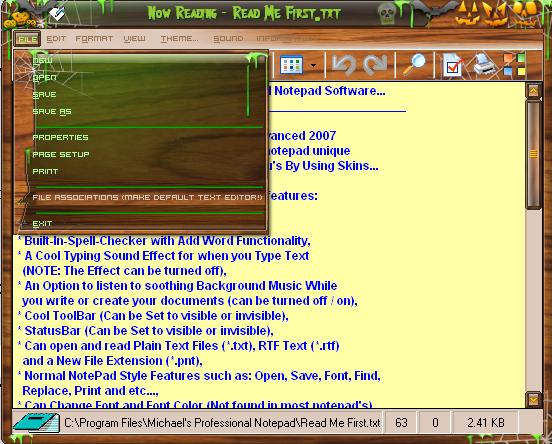

<div align="center">

## Skinnable Windows NotePad Clone \(Professional NotePad\!\) \- \(Update March 9th, 2007\)


</div>

### Description

Professional NotePad! - Is a Cool 2007 Windows Notepad Clone with the ability to change Themes... Professional Notepad Uses WindowBlinds Technology for the Skinning... NOTE: A Third Party ActiveX Control is Required... Uses DirectSkin For The ActiveX Control http://www.stardock.com

You do not need WindowBlinds to Skin This Notepad The Coolest part about the skinning is Any WindowBlinds Theme that you download off of the internet will work with My Notepad...

Professional NotePad Was Written and Developed By Me (Michael J. Hardy) Using Visual Basic 6.0 This is Actually My Very First VB Program that Doesn't Use Open Source however, some modules where found on this site...

Update: March 9th, 2007 - The Toolbar Highlight is Now Xp Style and Skinnable...

You can choose to Have the Notepad Minimize to the System Tray... This Feature can Also be toggled On/Off like all of the other features... Please Vote! I would like some Help with This Notepad So if you have Visual Basic Experiance Please Help with this development.. You will be greatly rewarded... I'd like to make this the best notepad clone available... Thank You... Email Me at notepad@fidmail.com if you would like to help...
 
### More Info
 
This Source Code is Released Under The GNU General Public License Agreement... If You download this Source You Are Required To Help with the Development before using it... Please Help me Make this Software the BEST Windows Notepad Clone Available... Thank You...

Extremely Adictive Skinning Habits!


<span>             |<span>
---                |---
**Submitted On**   |2007-03-08 02:18:14
**By**             |[Michael Hardy](https://github.com/Planet-Source-Code/PSCIndex/blob/master/ByAuthor/michael-hardy.md)
**Level**          |Intermediate
**User Rating**    |4.5 (36 globes from 8 users)
**Compatibility**  |VB 6\.0
**Category**       |[Complete Applications](https://github.com/Planet-Source-Code/PSCIndex/blob/master/ByCategory/complete-applications__1-27.md)
**World**          |[Visual Basic](https://github.com/Planet-Source-Code/PSCIndex/blob/master/ByWorld/visual-basic.md)
**Archive File**   |[Skinnable\_205261392007\.zip](https://github.com/Planet-Source-Code/michael-hardy-skinnable-windows-notepad-clone-professional-notepad-update-march-9th-2007__1-67686/archive/master.zip)

### API Declarations

```
'This Source Code is Released Under The GNU General Public License Agreement... If You download this Source You Are Required To Help with the Development before using it... Please Help me Make this Software the BEST Windows Notepad Clone Available... Thank You...'
```


